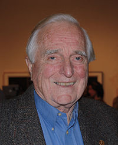

## Douglas Engelbart - 滑鼠背後的那個人

雖說 PARC 幾乎發明了視窗系統的大部分技術，但是如果少掉了不屬於 PARC 的「英格巴特」 (Douglas Englebart)，
那整個故事就有了缺憾！

英格巴特除了發明了滑鼠，而被稱為 The man behind the mouse 之外，他們還開發了超連結文字系統  (Hypertext System)、
而且他還是 Internet 前身 ARPANet 發明的關鍵人物。

英格巴特深受 Vannevar Bush 1945 年出版的 [As We May Think] 這篇文章的啟發，立志用電腦來讓世界變得更好，從
加州柏克萊大學電子工程系畢業後，在 1953 年取得碩士學位，然後在 1955 年取得博士學位。

1957 年英格巴特進入了 Stanford Research Institute (SRI) 這個研究機構，先是為 Hewitt Crane 作電磁裝置研究，後來
因為 [Augmenting Human Intellect: A Conceptual Framework] 這篇文章受到國防部先進研究中心 DARPA 的重視，讓他成立了 
Augmentation Research Center (ARC) 這個實驗室，後來他致立於 oN-Line System (NLS) 這個系統的研究，因而發展出了
位元映射螢幕 (Bitmapped Screen)，滑鼠 (Mouse)、超文字系統 (Hypertext) 等，這也導致後來全錄 PARC 的人受到啟發，
並且透過原本就任職 DARPA 且資助 Engelbart 的泰勒讓全錄繼續資助他的計劃，因此 Engelbart 與全錄 PARC 的關係也可說
是密不可分的。

英格巴特在 1968 年在 Fall Joint Computer Conference 作了一場驚人的展示，整場展示總共有 100 分鐘，您可以從以下網址
看到這場展示的完整內容：

* Doug Engelbart 1968 Demo -- <http://sloan.stanford.edu/mousesite/1968Demo.html>

以下是 SRI 所上傳的重要節錄影片，筆者對每一段都加上簡短的說明，以方便讀者快速觀看。

節錄段落	長度        網址                            說明
----------  ---------   ------------------------------  ----------------------------------------------------------------------
1           00分39秒    <http://youtu.be/VScVgXM7lQQ>   Engelbart 說明要以展示為主，包含立即互動式的文件編輯與視訊會議
2           06分25秒    <http://youtu.be/Xptc6f3Daoo>   Engelbart 展示如何用滑鼠簡貼、選取功能表項目、用滑鼠點閱圖形等功能
3           01分31秒    <http://youtu.be/agdPQuFr0yg>   Engelbart 說明目前的編輯功能限制，並邀請人們進行技術的改進
4           01分42秒    <http://youtu.be/hRYnloqYKGY>   控制部分：展示實際操作的「鍵盤、滑鼠、與現場編輯狀況的對應 
5           01分58秒    <http://youtu.be/OA0ppjh3Or4>   硬體部分：講解該電腦結構與設計的原理
6           03分44秒    <http://youtu.be/qisaqiysp2s>   軟體部分：Jeff 出現講解軟體，並與 Engelbart 進行現上會議交談。
7           01分30秒    <http://youtu.be/u36O0z7rm9M>   利用滑鼠與鍵盤進行檔案選取、編輯、修改等管理動作。
8           02分59秒    <http://youtu.be/qI8r8D46JOY>   即時合作：Engelbart 與夥伴展示如何合作共同編輯互動等技術
9           02分04秒    <http://youtu.be/eB7YtQTtxn0>   期他計畫：特別是關於 ARPANet 網路等計畫的說明。
10          02分03秒    <http://youtu.be/61nL6utq91Q>   團隊介紹：特別是關於 ARPANet 網路等計畫的說明。

在這場展示中，他們所展示的正是 oN-Line System (NLS) 這個系統，整個系統包含「滑鼠、超文字、網路、互動視訊會議」，
整場 100 分鐘完整的展示目前都還完整的被保留下來，堪稱完美的科技歷史記錄。

### 參考文獻
* <http://en.wikipedia.org/wiki/As_We_May_Think>
* <http://en.wikipedia.org/wiki/PARC_(company)>
* <http://en.wikipedia.org/wiki/The_Mother_of_All_Demos>
* [Augmenting Human Intellect: A Conceptual Framework, By Douglas C. Engelbart, October 1962](http://www.dougengelbart.org/pubs/augment-3906.html)
* Doug Engelbart 1968 Demo -- <http://sloan.stanford.edu/mousesite/1968Demo.html>
* [創新未酬, Dealers of Lightning, 作者：西爾吉克, 譯者：洪裕翔, 出版社：天下文化](http://www.books.com.tw/exep/prod/booksfile.php?item=0010152673)

[As We May Think]:http://en.wikipedia.org/wiki/As_We_May_Think
[Augmenting Human Intellect: A Conceptual Framework]:http://www.dougengelbart.org/pubs/augment-3906.html

【本文由陳鍾誠取材並修改自維基百科】

