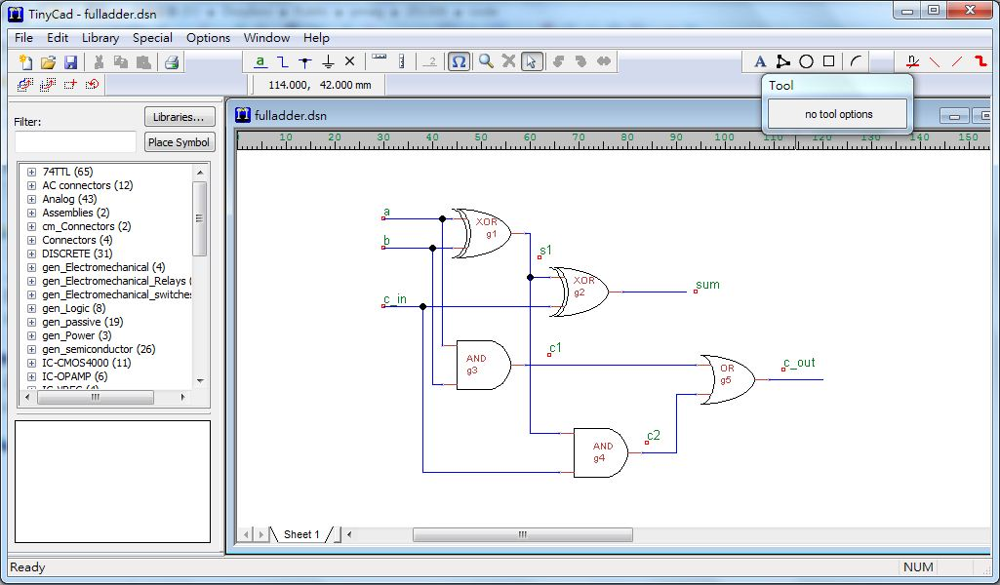

## 看影片學用 TinyCAD 畫電路圖

畫圖的軟體有很多，但是好用的畫電路圖的軟體感覺就不太多了，特別是開放原始碼的軟體，就更少了！

TinyCAD 是我所用過最好用的電路圖軟體 (可惜好像只有支援 MS Windows 平台)，在本文中，我們將用實際的錄影，
示範如何用 TinyCAD 建構出以下的全加器的電路圖：

如果讀者想要照著操作，首先請到下列網址下載 TinyCAD 並且安裝到電腦上，然後就可以一邊看影片一邊學習如何操作了：

* <http://tinycad.sourceforge.net/>

以下影片是筆者的操作過程：

* <http://youtu.be/VmQCvqqaUsQ>

【本文由陳鍾誠撰寫】

